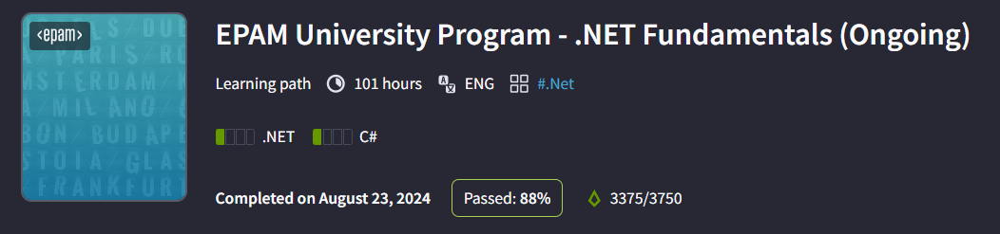

# Denis Yeresko

As a passionate learner in the field of software development, my
experience primarily revolves around foundational learning and
practical application through personal projects and academic
coursework. While I haven't yet worked professionally in
development, my journey in technology has been characterized
by proactive skill-building and project exploration.

## Contact
**Location**\
Ukraine

**Phone**\
+380661700810

**Email**\
dyeresko@outlook.com

**Github**\
[dyeresko](https://github.com/dyeresko)

## Expertise
- C#
- ASP .NET
- Javascript
- Python
- SQL
- HTML/CSS
- Git

## Code example

```js
function removeDuplicate(array) {
    let result = [];
    for (let i = 0; i < array.length; i++)
    {
        if (!result.includes(array[i]))
        {
            result.push(array[i]);
        }
    }
    return result;
}
```

## Work experience
No work experience.


## Courses
- .NET Fundamentals (completed)\


## Languages
- English - Upper-Intermediate
- Ukrainian - Native
- Russian - Native

